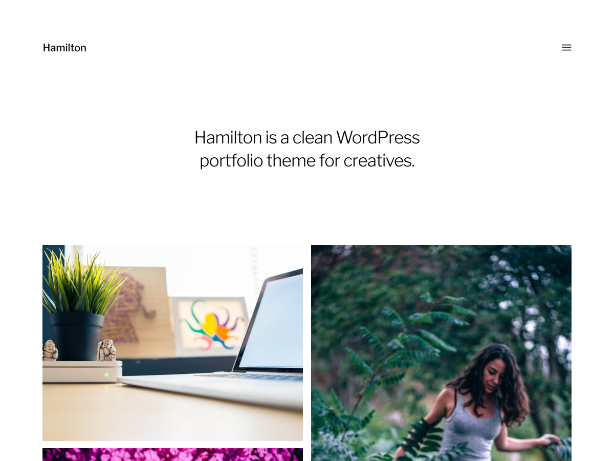

# OndrejdFirst

Clean responsive theme for my [personal site][2] built on [WordPress][1]. Is derrived from __Hamilton__ theme by [Anders Norén][3].

## Main features

* clean responsive theme,
* three color profiles: __White__~~, __Ubuntu__ and __Ubuntu Dark__~~,
* highly customizable using __Theme Customizer__,
* heavy [WooCommerce][4] support,
* Czech ~~and English~~ localization.

## Screenshots

## TODO

* [ ] __FIXME__: When changing setting `show_on_front` _previewer_ is not updated,
* [ ] __FIXME__: Customize buttons for `blogname` and `blogdescription` do not work,
* [ ] __Finish color profiles__,
* [ ] create more screenshots (different color modes, WooCommerce),
* [ ] create screencast how much is theme customizable (just record session in __Theme Customizer__),
* [ ] Add English locales.

[1]:https://wordpress.org/
[2]:https://ondrejd.com/
[3]:http://www.andersnoren.se/teman/hamilton-wordpress-theme/
[4]:https://woocommerce.com/
